<picture>
    <source media="(prefers-color-scheme: dark)" srcset="images/microchip_logo_white_red.png">
	<source media="(prefers-color-scheme: light)" srcset="images/microchip_logo_black_red.png">
    
</picture>

# dsPIC33CK512MPT608 Provision Prototyping

## Summary

The dsPIC33CK512MPT608 Provision Prototyping code example shows how to configure the CryptoAuthentication Library (CAL) in MCC Melody to enable prototype provisioning within Trust Platform Design Suite (TPDS).

The [dsPIC33CK512MPT608](https://www.microchip.com/dsPIC33CK512MPT608) device is a System in Package (SiP) containing a Hardware Security Module [TA100](https://www.microchip.com/ta100) internally connected to the microcontroller over a SPI bus.

## Related Documentation

- [MCC Melody CryptoAuthenticaton Library Release Notes](https://onlinedocs.microchip.com/v2/keyword-lookup?keyword=MCC.MELODY.CAL.RELEASENOTES&version=latest&redirect=true)
- [CryptoAuthentication Library GitHub](https://www.github.com/MicrochipTech/cryptoauthlib)
- [Secure Element Provision Prototyping Documentation](https://onlinedocs.microchip.com/v2/keyword-lookup?keyword=KIT_PROTOCOL&version=latest&redirect=true)

## Software Used 
- MPLAB® X IDE **6.25** (https://www.microchip.com/MPLABXIDE)
- MPLAB® XC-DSC Compiler **3.21** or a newer compiler (https://www.microchip.com/xcdsc)
- MPLAB® Code Configurator (MCC) Plugin **5.5.2** (https://www.microchip.com/mcc)
- MPLAB® Code Configurator (MCC) Core **5.7.1** (https://www.microchip.com/mcc)
- MPLAB® Code Configurator (MCC) Melody **2.9.2** (https://www.microchip.com/melody)
- Crypto Authentification Library **5.11.0** (https://www.npmjs.com/package/@mchp-mcc/crypto-authentication-library)
- Trust Anchor Library **2.1.0** or newer
- Trust Platform Design Suite **2.3.9** (https://www.microchip.com/tpds)

## Hardware Used

- Explorer 16/32 Board (https://www.microchip.com/dm240001-2)
- dsPIC33CK512MPT608 PIM (https://www.microchip.com/ev10h29a)
- MPLAB® PICkit™ 5 In-Circuit Debugger (https://www.microchip.com/PG164150) or MPLAB® ICD 4 In-Circuit Debugger (https://www.microchip.com/dv164045) or MPLAB® PICkit™ 4 In-Circuit Debugger (https://www.microchip.com/PG164140)

## Prerequisites

The Secure Document Extranet (SDE) is a platform available through the [myMicrochip](https://www.microchip.com/myMicrochip/#/) portal that allows users to access secure documents. Follow the directions found in the [SDE User Guide](https://www.microchip.com/en-us/support/sde-user-guide) to get access to the SDE.

> **NOTE:** This project requires a non-public version of TA100 support. 

1. Follow the steps found in the "Request Access to Information About Specific Products" section of the [SDE User Guide](https://www.microchip.com/en-us/support/sde-user-guide) to request secure documents on myMicrochip.

2. The items that are needed are covered under an NDA and need to be requested. The following need to be requested: 
    - TA10x-TCSM TPDS configurator - v2.7.1 (see ["TPDS Setup"](#tpds-setup))
      - This configurator allows for TPDS to communicate and configure a TA100 secure element.
    - TA-Lib-MCC - v2.1.0
      - Allows for the inclusion of Trust Anchor configuration in the MCC Melody CryptoAuthentication Library module.
    - TA100 Documentation
      - Provides information about the TA100 secure element.
  
> **NOTE:** The TA100 Documentation is not required, but it is a great resource on the TA100 secure element. It is highly recommended to request access to this document when working with the TA100.

## Setup

### Hardware Setup

1. Connect the In-Circuit Debugger to the board.

2. Connect the board to the computer using a USB cable, connecting to the Serial port.

    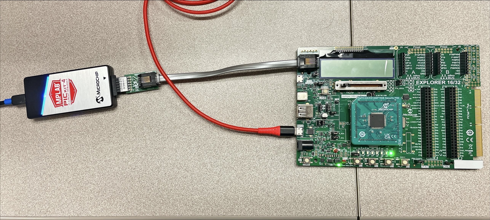
        
### TPDS Setup

The Trust Platform Design Suite is an onboarding tool used for our security-related solutions. It is used to configure and generate provisioning information for secure elements like a Trust Anchor device through its configurators. TPDS can be used to prototype provision to quickly provision a secure element for testing purposes. Once users are ready to move to production, TPDS can be used to create a provisioning package with dummy keys that must be exchanged with Microchip support for an actual secure package.

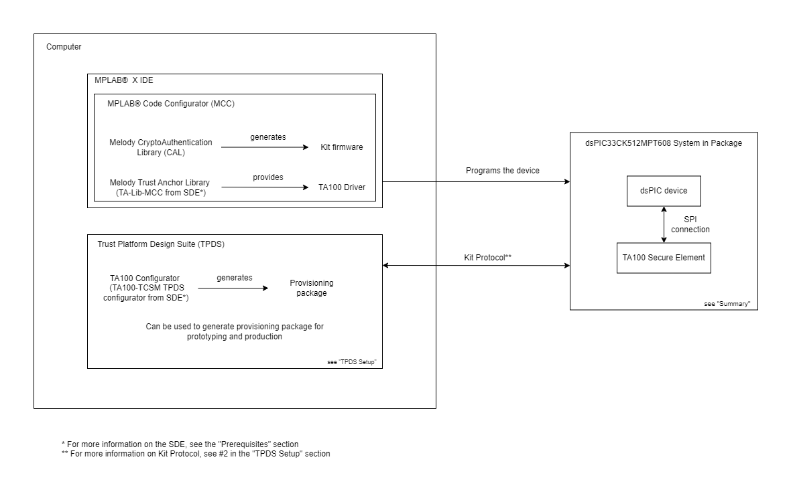

1. **Trust Platform Design Suite (TPDS) Installation**
    - Go to [TPDS](https://www.microchip.com/en-us/products/security/trust-platform/tpds).
    - Select Download TPDSv2 for your operating system.
    - Follow the steps on the installer and [installation guide](https://developerhelp.microchip.com/xwiki/bin/view/applications/security/trust-platform-v2/).
    - After installation complete the following steps:
    - Ensure TPDS is version 2.3.9 or higher
    - For dsPIC33 devices:
        - Open the Trust Platform Design Suite application.
            - Select the "Utilities" tab.
            - Select "Package Manager".
            - Find the extension named **"tpds-extension-dspic33-support"** and select the check box to install the content.
            - Select the "Install Selected Packages" button at the top.
            - Restart the application.
            - The version 1.0.1 or higher is now installed.
2. **Some Secure Elements require a request from the Secure Document Exchange (SDE) on [myMicrochip](https://www.microchip.com/myMicrochip)**
    - [Accessing Secure Documents](https://ww1.microchip.com/downloads/aemDocuments/documents/OTH/ProductDocuments/SupportingCollateral/Secure-Documents-MyMCHP-00004722.pdf)
    - An access request will need to be made for secure documents
        - Some documents/content require an NDA and this will be completed in tandem with the access request.
    - After receiving an email confirming access to the requested SDE document, install any MCC content and/or TPDS extension that may be required for provisioning Secure Element. Most secure documents come with a readme and/or installation guide.
    - Here is an example of content required for the dsPIC33 with the TA100:
        - MCC Melody Trust Anchor Library is required for TA100 Secure Element Support.
            - How to request access:
                - Under the Request Access section of myMicrochip, search and request access for the product "TA-Lib-MCC".
        - Additional steps to install can be found [here](https://onlinedocs.microchip.com/oxy/GUID-FB7A0655-D622-421B-83A7-138A38158B6D-en-US-8/GUID-7D69101E-EA71-47BE-B794-7F2CA6363B2C.html).
    - TPDS requires a TA10x extension to be installed:
        - How to request access:
            - Under the Request Access section of myMicrochip, search and request access for product **"TA10x-TCSM TPDS configurator"** in the **All Products** dropdown. 
            - A dialogue will ask to add an active NDA. Select the "No, Proceed" option to submit the request. **It will take some time for the approval process to complete.**
            - Then download the extension under the Document Search section of myMicrochip. Filter by **"TA10x TPDS extension"** choosing version v2.7.1.
            - To install the extension simply open the Trust Platform Design Suite application
                - Select the "Utilities" tab.
                - Select "Package Manager".
                - Click on "Install TPDS Extension" button.
                - Select the file(s) given on myMicrochip.

> **NOTE:** TPDS needs to be restarted before the changes are applied.

### TALib Setup 

1. Install TA-Lib-MCC by following the steps in the Installing MPLAB® Code Configurator Melody Trust Anchor Library section of the [CAL Release Notes](https://onlinedocs.microchip.com/v2/keyword-lookup?keyword=TALIB_SETUP&version=latest&redirect=true).

## Running the Demo
1. Launch the MPLAB® X IDE and load the "dsPIC33CK512MPT608_provision_prototyping.X" project.

2. Launch MCC Melody.

3. Right-click on the "Generate" button and select the "Force Update on All" option. This will generate files for the MCC Melody Trust Anchor Library that we added to the project in the TALib Setup step.

    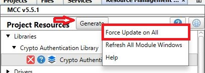

4. Click the "Generate" button. The CAL files should generate successfully.

    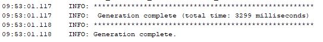

5. When the merge window pops up, select the "Replace All" option to accept all changes for each file.  

    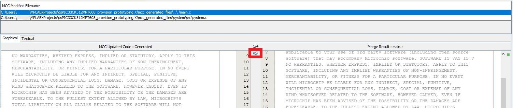

6. Make and program the device.

7. Power cycle the board.

### TPDS 

1. Launch the Trust Platform Design Suite.

2. Select the "Configurators" tab at the top.

    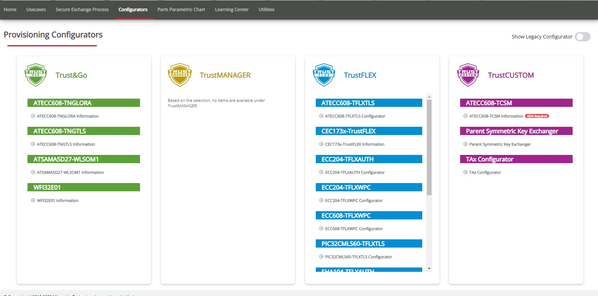

3. Select the TAx Configurator under the TrustCUSTOM Section.
4. Update the Device Configuration Options:
    - Device: TA100 
    - Package Option: 8 Pin SOIC
    - I/O Type: SPI Interface
    - Configuration Lock: Unchecked
    - Setup Lock: Unchecked

    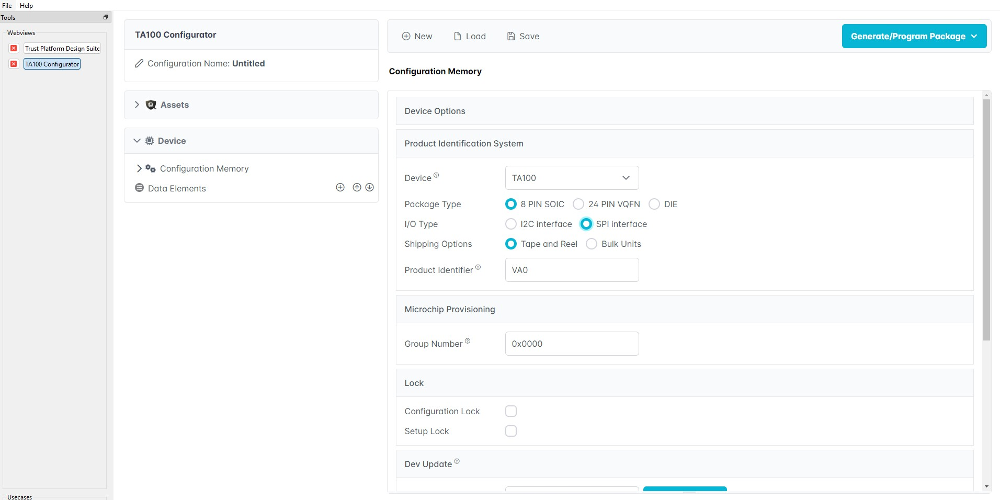

5. Select the "Generate/Program Package" dropdown and click "Generate Proto Provisioning Package"

    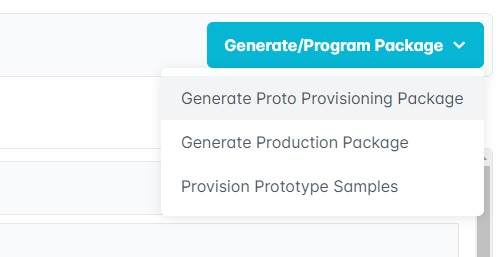

    - After saving the generated zip a successful generation dialog will popup:

        

6.  Select the "Generate/Program Package" dropdown and click "Provision Prototype Samples"

    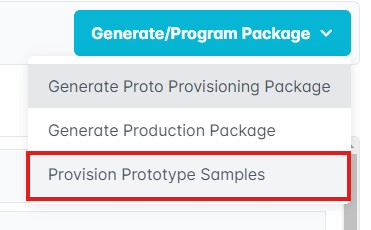

    - A popup to select a board to provision with will appear. Select the Explorer 16/32 Board (DM240001-2)

    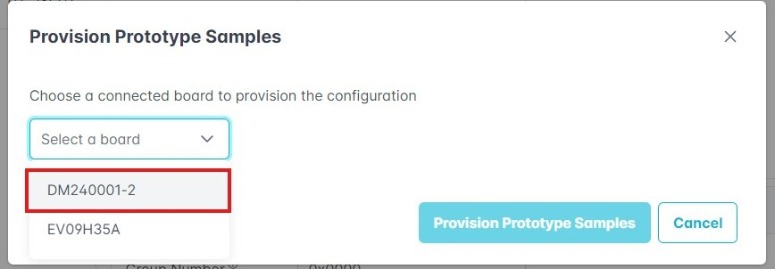

    - Then select the "Provision Prototype Samples" button

    - Successful provisioning will result in the following popup:

        

## Appendix

### MPLAB® X IDE Setup for New Projects

1. Launch MPLAB® X IDE. 
2. Create a new project with the dsPIC33CK512MPT608 as the device. 
3. Open MCC Melody.

4. Add the Crypto Authentication Library (CAL).

    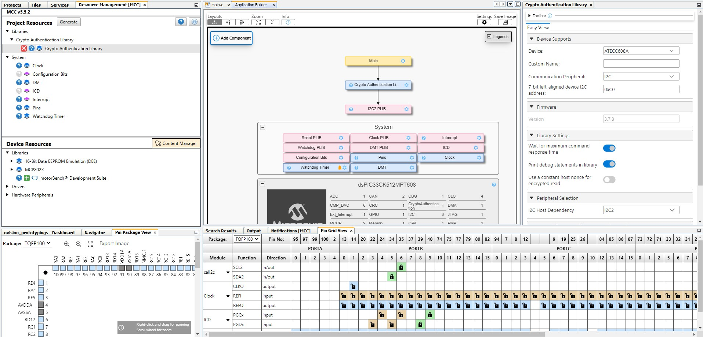

5. Open the Easy View to see the CAL settings. 

6. In the "Device" dropdown, select "Internal Secure Subsystem."

    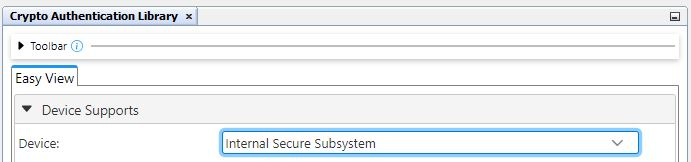

7. The "Communication Peripheral" should be locked as "SPI." Select a SPI PLIB in the "SPI Host Dependency" dropdown.

    

    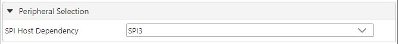

8. Toggle the "Enable Kit Protocol" option so that Kit Protocol is selected.

    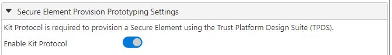

9.  Set the UART pins. 
    - U3RX: RD2
    - U3TX: RD1

    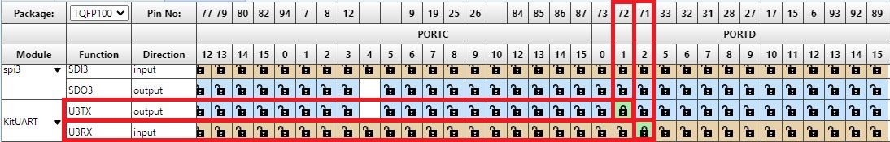

10. Set the system clock of the device to maximum

    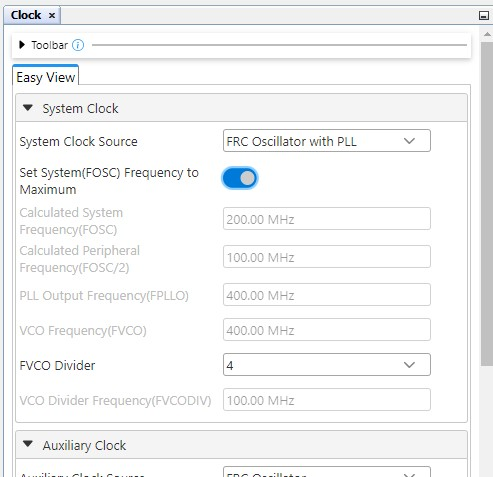

11. Click the "Generate" button. The CAL files should generate successfully.

    

12. Make and program the device.

13. Follow the steps listed under "Running the Demo -> TPDS" to provision prototypes.

# Version Compatability
|dsPIC33CK512MPT608 Provision Prototyping|TPDS|TA Configurator|MCC CAL Library|TA-Lib-MCC|
|---|---|---|---|---|
|v1.0.1|2.3.9|TAx Legacy Configurator|v5.8.0|v1.2.0|
|v1.0.2|2.3.9|TAx Configurator|v5.11.0|v.2.1.0|
