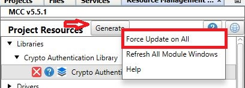
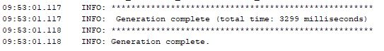
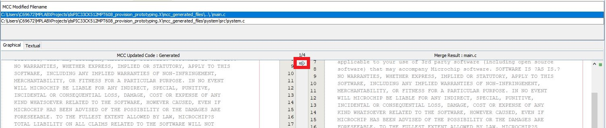
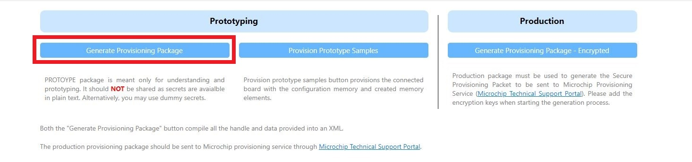
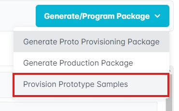
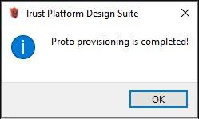
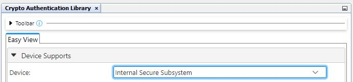
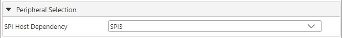
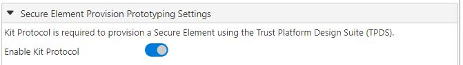
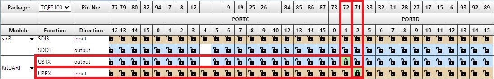

<picture>
    <source media="(prefers-color-scheme: dark)" srcset="images/microchip_logo_white_red.png">
	<source media="(prefers-color-scheme: light)" srcset="images/microchip_logo_black_red.png">
    
</picture>

# dsPIC33CK512MPT608 Provision Prototyping

## Summary

The dsPIC33CK512MPT608 Provision Prototyping code example shows how to configure the CryptoAuthentication Library to enable prototype provisioning within Trust Platform Design Suite (TPDS).

## Related Documentation

- [MCC Melody CryptoAuthenticaton Library Release Notes](https://onlinedocs.microchip.com/v2/keyword-lookup?keyword=MCC.MELODY.CAL.RELEASENOTES&version=latest&redirect=true)
- [CryptoAuthentication Library GitHub](https://github.com/MicrochipTech/cryptoauthlib)
- [Secure Provision Prototyping Documentation](https://onlinedocs.microchip.com/v2/keyword-lookup?keyword=KIT_PROTOCOL&version=latest&redirect=true)

## Software Used 
- MPLAB® X IDE **6.20** or newer (https://www.microchip.com/MPLABXIDE)
- MPLAB® XC-DSC Compiler **3.00** or a newer compiler (https://www.microchip.com/xc)
- MPLAB® Code Configurator (MCC) Plugin **5.5.1** or newer (https://www.microchip.com/mcc)
- MPLAB® Code Configurator (MCC) Core **5.7.1** or newer (https://www.microchip.com/mcc)
- MPLAB® Code Configurator (MCC) Melody **2.7.1** or newer (https://www.microchip.com/melody)
- Crypto Authentification Library **5.8.0** or newer (https://www.npmjs.com/package/@mchp-mcc/crypto-authentication-library)
- Trust Anchor Library **1.2.0** or newer (https://www.microchip.com/mymicrochip/#)
- Trust Platform Design Suite **2.3.9** or newer (https://www.microchip.com/en-us/products/security/trust-platform/tpds)

## Hardware Used

- Explorer 16/32 Board (https://www.microchip.com/dm240001-2)
- dsPIC33CK512MPT608 PIM (https://www.microchip.com/dsPIC33CK512MPT608)
- MPLAB® ICD 4 In-Circuit Debugger (https://www.microchip.com/dv164045) or MPLAB® PICkit™ 5 In-Circuit Debugger (https://www.microchip.com/PG164150) or MPLAB® PICkit™ 4 In-Circuit Debugger (https://www.microchip.com/PG164140)

## Prerequisites

### TA100 Setup

**NOTE:** This project requires a non-public version of TA100 support. 

1. Follow [these steps](https://ww1.microchip.com/downloads/aemDocuments/documents/OTH/ProductDocuments/SupportingCollateral/Secure-Documents-MyMCHP-00004722.pdf) to request secure documents on myMicrochip.

2. The two items that need to be requested are:
    - TA100-TCSM TPDS configurator (see "TPDS Setup")
    - TA-Lib-MCC

3. For TA-Lib-MCC follow steps [here](https://onlinedocs.microchip.com/oxy/GUID-7F2639F3-1541-4BFC-A031-9A718BFFC502-en-US-18/GUID-7D69101E-EA71-47BE-B794-7F2CA6363B2C.html).

4. The "Trust Anchor Library" should now be visible in the MCC Melody Content Manager.

## Setup

### Hardware Setup

1. Connect the In-Circuit Debugger to the board.

2. Connect the board to the computer using a USB cable, connecting to the Serial port.

    
        
### TPDS Setup

1. Install TPDS (https://www.microchip.com/en-us/products/security/trust-platform/tpds).

2. Follow the instructions found [here](https://internal.onlinedocs.microchip.com/v2/keyword-lookup?keyword=KIT_PROTOCOL&version=latest&redirect=true).

**NOTE:** TPDS needs to be restarted before the changes are applied.

## Running the Demo
1. Launch the MPLAB® X IDE and load the "dsPIC33CK512MPT608_provision_prototyping.X" project.

2. Launch MCC Melody.

3. Right-click on the "Generate" button and select the "Force Update on All" option.

    

4. Click the "Generate" button. The CAL files should generate successfully.

    

5. When the merge window pops up, select the "Replace All" option to accept all changes.  

    

6. Make and program the device.

### TPDS 

1. Launch the Trust Platform Design Suite (TPDS).

2. Select the "Configurators" tab at the top.

    

3. Select the TA100 Configurator under the TrustCUSTOM Section.
4. Update the Device Configuration Options:
    - Package Option: 8 Pin SOIC
    - I/O Type: SPI Interface
    - Config Memory Lock: Unchecked
    - Setup Lock: Unchecked

        

5. Click "Generate Provisioning Package"

    

    - Successful generation will result in the following popup:

        

6.  Click "Provision Prototype Samples"

    

    - Successful provisioning will result in the following popup:

        

## Appendix

### MPLAB® X IDE Setup for New Projects

1. Launch MPLAB® X IDE. 
2. Create a new project with the dsPIC33CK512MPT608 as the device. 
3. Open MCC Melody.

4. Add the Crypto Authentication Library.

    

5. Open the Easy View to see the CAL settings. See the **CAL Settings** section below fo an explanation on each setting.

6. In the "Device" dropdown, select "Internal Secure Subsystem."

    

7. The "Communication Peripheral" should be locked as "SPI." Select a SPI PLIB in the "SPI Host Dependency" dropdown.

    

    

8. Toggle the "Enable Kit Protocol" option so that kit protocol is selected.

    

9.  Set the UART pins. 
    - U3RX: RD2
    - U3TX: RD1

    

#### CAL Settings
- Device Supports
  - Device: This is the secure element that will be used. 
  - Custom Name: Allows the user to set a custom name for the secure element.
  - Communication Peripheral: The communication method that the device will be using (ex: SPI, I2C)
- Firmware
  - Version: Version of the firmware used by the module.
- Library Settings
  - Wait for maximum command response time:
  - Print debug statements in library:
  - Use a constant host nonce for encrypted read:
- Peripheral Selection
  - Host Dependency: The exact PLIB that the secure element will use. This is based on the "Communication Peripheral" in the Device Supports section.
- Secure Element Provision Prototyping Settings
  - Enable Kit Protocol: Enables kit protocol for the project.